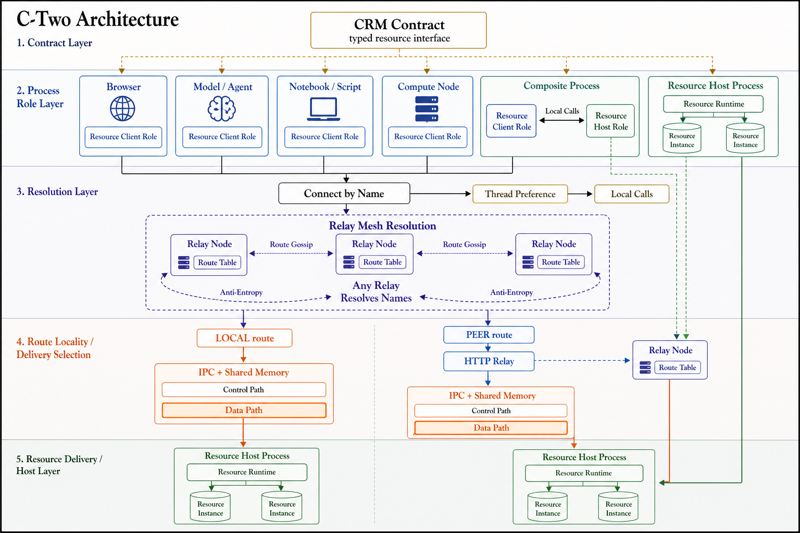

<p align="center">
  
</p>

<h1 align="center">C-Two</h1>

<p align="center">
  A resource-oriented RPC runtime — turn stateful classes into location-transparent distributed resources.
</p>

<p align="center">
  <a href="https://pypi.org/project/c-two/"></a>
  <a href="https://pypi.org/project/c-two/"></a>
  
  <a href="https://github.com/world-in-progress/c-two/actions/workflows/ci.yml"></a>
  <a href="LICENSE"></a>
</p>

<p align="center">
  <a href="README.zh-CN.md">中文版</a>
</p>

---

## Basic Idea

- **Resources, not services** — C-Two does not expose RPC endpoints. It exposes stateful resource objects through language SDKs. The Python SDK makes Python classes remotely accessible while preserving their object-oriented nature.

- **Zero-copy from process to data** — Same-process calls skip serialization entirely. Cross-process IPC can hold shared-memory buffers alive, letting you read columnar data (NumPy, Arrow, …) directly from SHM — no deserialization, no copies.

- **Built for scientific workloads** — The Python SDK has native support for Apache Arrow, NumPy arrays, and large payloads (chunked streaming for data beyond 256 MB). Designed for computational workloads, not microservices.

- **Rust-powered core** — Shared transport, memory, wire codec, route-contract validation, relay, and configuration live in Rust so future SDKs reuse one runtime contract.

---

## Performance

End-to-end cross-process IPC benchmark — same NumPy payload (`row_id u32` + `x,y,z f64`), same machine, same aggregation. Three transport modes compared:

| Rows | C-Two hold (ms) | Ray (ms) | C-Two pickle (ms) | **Hold vs Ray** |
|-----:|---:|---:|---:|---:|
| 1 K | **0.07** | 6.1 | 0.19 | **86×** |
| 10 K | **0.09** | 7.1 | 0.82 | **79×** |
| 100 K | **0.38** | 9.8 | 8.7 | **26×** |
| 1 M | **3.7** | 58 | 150 | **15×** |
| 3 M | **9.7** | 129 | 598 | **13×** |

- **C-Two hold** — SHM zero-copy via `np.frombuffer`; no serialization on read
- **Ray** — object store with zero-copy numpy support (Ray 2.55)
- **C-Two pickle** — standard pickle over SHM; included to show serialization cost

> Apple M1 Max · Python 3.13 · NumPy 2.4 · See [`sdk/python/benchmarks/unified_numpy_benchmark.py`](sdk/python/benchmarks/unified_numpy_benchmark.py) for full methodology.

---

## Quick Start

```bash
pip install c-two
```

### Define a resource contract and its implementation

```python
import c_two as cc

# CRM contract — declares which methods are remotely accessible
@cc.crm(namespace='demo.counter', version='0.1.0')
class Counter:
    def increment(self, amount: int) -> int: ...

    @cc.read
    def value(self) -> int: ...

    def reset(self) -> int: ...


# Resource — a plain Python class implementing the contract
class CounterImpl:
    def __init__(self, initial: int = 0):
        self._value = initial

    def increment(self, amount: int) -> int:
        self._value += amount
        return self._value

    def value(self) -> int:
        return self._value

    def reset(self) -> int:
        old = self._value
        self._value = 0
        return old
```

### Use it locally (zero serialization)

```python
cc.register(Counter, CounterImpl(initial=100), name='counter')
counter = cc.connect(Counter, name='counter')

counter.increment(10)    # → 110
counter.value()          # → 110
counter.reset()          # → 110 (returns old value)
counter.value()          # → 0

cc.close(counter)
```

### Or remotely — same API, relay discovery

```python
# Server process
cc.set_relay_anchor('http://relay-host:8080')
cc.register(Counter, CounterImpl(), name='counter')

# Client process (separate terminal)
cc.set_relay_anchor('http://relay-host:8080')
counter = cc.connect(Counter, name='counter')
counter.increment(5)     # works identically
cc.close(counter)
```

> **See [`examples/python/`](examples/python/) for complete runnable demos.**

---

## Core Concepts

### CRM — Contract

A **CRM** (Core Resource Model) declares *which* methods a remote resource exposes. It's decorated with `@cc.crm()`, and method bodies are `...` (pure interface — no implementation).

```python
@cc.crm(namespace='demo.greeter', version='0.1.0')
class Greeter:
    @cc.read                              # concurrent reads allowed
    def greet(self, name: str) -> str: ...

    @cc.read
    def language(self) -> str: ...
```

Methods can be annotated with `@cc.read` (concurrent access allowed) or left as default write (exclusive access).

### Resource — Runtime Instance

A **resource** is a plain Python class that implements a CRM contract. It holds state and domain logic. It is **not** decorated — the framework discovers its methods through the CRM contract it was registered under. Name the class by what it *is* (`GreeterImpl`, `PostgresGreeter`, `MultilingualGreeter`), not the interface.

```python
class GreeterImpl:
    def __init__(self, lang: str = 'en'):
        self._lang = lang
        self._templates = {'en': 'Hello, {}!', 'zh': '你好, {}!'}

    def greet(self, name: str) -> str:
        return self._templates.get(self._lang, 'Hi, {}!').format(name)

    def language(self) -> str:
        return self._lang
```

### Client — Consumer

Anything that calls `cc.connect(...)` is a **client** (or consumer / application code). The returned proxy is location-transparent — it works the same whether the resource lives in the same process or on a remote machine.

```python
greeter = cc.connect(Greeter, name='greeter')
greeter.greet('World')     # → 'Hello, World!'
cc.close(greeter)

# Or with context manager:
with cc.connect(Greeter, name='greeter') as greeter:
    greeter.greet('World')
```

### Server — Resource Host

A **server** is any process that calls `cc.register(...)` to host one or more resources, then usually `cc.serve()` to block on the request loop. One server process can host many resources (each under a unique `name`), and will auto-bind an IPC endpoint the first time a resource is registered.

```python
import c_two as cc

cc.register(Greeter, GreeterImpl(), name='greeter')
cc.register(Counter, CounterImpl(), name='counter')
cc.serve()                                     # blocks; Ctrl-C triggers graceful shutdown
```

- **Server ID** identifies the local IPC server instance. C-Two generates one on first registration unless you call `cc.set_server(server_id=...)` before registering.
- **Address** (`ipc://...`) is the internal local transport endpoint derived from the server ID. Inspect it with `cc.server_address()` only when a same-host process needs to connect directly.
- **`cc.serve()`** is optional — if your host process has its own event loop (web server, GUI, simulation), you can register resources and let them serve in the background while your main loop runs.
- A process can be both a server and a client at the same time (register some resources, connect to others).

### Relay — Distributed Discovery

An **HTTP relay** (`c3 relay`) is a lightweight broker that lets clients reach servers **by route name and CRM contract**, across machines. Servers announce their IPC address plus CRM tag and contract fingerprints to the relay when they register; clients ask the relay with the route name and the expected CRM contract derived from `cc.connect(CRMClass, name='...')`.

The `c3` command is C-Two's cross-language native CLI. From a source checkout,
build and link a local development binary with
`python tools/dev/c3_tool.py --build --link`.
The Python SDK does not embed or start the relay server; start `c3 relay`,
Docker Compose, or your orchestrator separately, then point Python code at its
relay anchor with `C2_RELAY_ANCHOR_ADDRESS` or `cc.set_relay_anchor()`.
The anchor is the control-plane registration/name-resolution endpoint. Remote
HTTP calls still go directly to the resolved route's `relay_url`; local direct
IPC is used only when the anchor endpoint is loopback/local.
Relay-aware clients preflight routes before the first call and re-resolve
structured stale-route responses; set `C2_RELAY_ROUTE_MAX_ATTEMPTS` to tune the
maximum route acquisition attempts (default `3`, valid range `1..=32`, `0` is
treated as `1`). Set `C2_RELAY_CALL_TIMEOUT` to tune CRM call timeout seconds
(default `300`; `0` disables the reqwest total timeout). Ambiguous data-plane
failures are not replayed. Relay resolve, probe, and call paths reject
name-only lookups and CRM contract mismatches instead of falling back to an
untyped route with the same name.

```bash
# Start a relay anywhere reachable on your network
c3 relay --bind 0.0.0.0:8080
```

Relay HTTP and mesh endpoints are intended for a trusted network boundary. Do
not expose them directly to the public internet; production deployments should
restrict access with infrastructure such as private networking, firewalls,
Kubernetes NetworkPolicy, service mesh policy, or ingress authentication.

```python
# Server side — announce resources to the relay
cc.set_relay_anchor('http://relay-host:8080')
cc.register(MeshStore, MeshStoreImpl(), name='mesh')
cc.serve()

# Client side — resolve by name plus the MeshStore CRM contract, no address needed
cc.set_relay_anchor('http://relay-host:8080')
mesh = cc.connect(MeshStore, name='mesh')
```

Multiple relays can form a **mesh cluster** via gossip — any relay can resolve any resource registered anywhere in the mesh. See the [Relay Mesh example](#relay-mesh--multi-relay-clusters) below.

> **When do I need a relay?** Only for cross-machine or name-and-contract-based discovery. Same-process and same-host (IPC) usage work without any relay.

### @transferable — Custom Serialization

For custom data types that need to cross the wire, use `@cc.transferable`. Without it, pickle is used as fallback.

A transferable class defines up to three static methods (written without `@staticmethod` — the framework adds it automatically):

| Method | Required | Purpose |
|--------|----------|---------|
| `serialize(data) → bytes` | ✅ Yes | Encode data for wire transfer (outbound) |
| `deserialize(raw) → T` | ✅ Yes | Decode wire bytes into an owned Python object (inbound) |
| `from_buffer(buf) → T` | ❌ Optional | Build a zero-copy view over the raw buffer (inbound, hold mode) |

```python
import numpy as np

@cc.transferable
class Matrix:
    rows: int
    cols: int
    data: np.ndarray

    def serialize(mat: 'Matrix') -> bytes:
        header = struct.pack('>II', mat.rows, mat.cols)
        return header + mat.data.tobytes()

    def deserialize(raw: bytes) -> 'Matrix':
        rows, cols = struct.unpack_from('>II', raw)
        arr = np.frombuffer(raw, dtype=np.float64, offset=8).reshape(rows, cols)
        return Matrix(rows=rows, cols=cols, data=arr.copy())  # owned copy

    def from_buffer(buf: memoryview) -> 'Matrix':
        header = bytes(buf[:8])
        rows, cols = struct.unpack('>II', header)
        arr = np.frombuffer(buf[8:], dtype=np.float64).reshape(rows, cols)
        return Matrix(rows=rows, cols=cols, data=arr)  # zero-copy view into SHM
```

When `from_buffer` is present, the server automatically uses **hold mode** — the SHM buffer stays alive so `from_buffer` can return a zero-copy view. Without `from_buffer`, the server uses **view mode** — the buffer is released immediately after `deserialize`.

### @cc.transfer — Per-Method Control

Use `@cc.transfer()` on CRM contract methods to explicitly specify which transferable type handles serialization, or to override the buffer mode:

```python
@cc.crm(namespace='demo.compute', version='0.1.0')
class Compute:
    @cc.transfer(input=Matrix, output=Matrix, buffer='hold')
    def transform(self, mat: Matrix) -> Matrix: ...

    @cc.transfer(input=Matrix, buffer='view')  # force copy even if from_buffer exists
    def ingest(self, mat: Matrix) -> None: ...
```

Without `@cc.transfer`, the framework automatically matches registered `@transferable` types by function signature and resolves the buffer mode from the input type's capabilities.

### cc.hold() — Client-Side Zero-Copy

On the client side, `cc.hold()` requests that the response SHM buffer remain alive, enabling zero-copy reads of the result. The returned `HeldResult` wraps the value and provides a three-layer safety net for SHM lifecycle:

1. **Explicit `.release()`** — preferred for complex workflows holding multiple buffers
2. **Context manager (`with`)** — recommended for single-buffer scopes
3. **`__del__` fallback** — last resort, emits `ResourceWarning` if you forget to release

```python
grid = cc.connect(Compute, name='compute', address='ipc://server')

# Normal call — buffer released immediately after deserialize
result = grid.transform(matrix)

# Option 1: Context manager — clean for single holds
with cc.hold(grid.transform)(matrix) as held:
    data = held.value          # zero-copy NumPy array backed by SHM
    process(data)              # read directly from shared memory
# SHM buffer released on context exit

# Option 2: Explicit release — better for multiple concurrent holds
a = cc.hold(grid.transform)(matrix_a)
b = cc.hold(grid.transform)(matrix_b)
try:
    combined = np.concatenate([a.value.data, b.value.data])
    process(combined)
finally:
    a.release()
    b.release()
```

> **When to use hold mode:** Large array/columnar data where deserialization dominates cost. For small payloads (< 1 MB), the overhead of tracking SHM lifecycle exceeds the copy cost.

---

## Examples

### Single Process — Thread Preference

When `cc.connect()` targets a CRM registered in the same process, the proxy calls methods directly with **zero serialization overhead**.

```python
import c_two as cc

cc.register(Greeter, GreeterImpl(lang='en'), name='greeter')
cc.register(Counter, CounterImpl(initial=100), name='counter')

greeter = cc.connect(Greeter, name='greeter')
counter = cc.connect(Counter, name='counter')

print(greeter.greet('World'))    # → Hello, World!
print(counter.value())           # → 100
counter.increment(10)

cc.close(greeter)
cc.close(counter)
cc.shutdown()
```

> **Best for:** local prototyping, testing, single-machine computation.

### Multi-Process IPC — with Custom Transferable

Separate server and client processes communicating over Unix domain sockets with shared memory.

**Shared types** (`types.py`):
```python
import c_two as cc
import numpy as np, struct

@cc.transferable
class Mesh:
    n_vertices: int
    positions: np.ndarray   # (N, 3) float64

    def serialize(mesh: 'Mesh') -> bytes:
        header = struct.pack('>I', mesh.n_vertices)
        return header + mesh.positions.tobytes()

    def deserialize(raw: bytes) -> 'Mesh':
        (n,) = struct.unpack_from('>I', raw)
        arr = np.frombuffer(raw, dtype=np.float64, offset=4).reshape(n, 3).copy()
        return Mesh(n_vertices=n, positions=arr)

    def from_buffer(buf: memoryview) -> 'Mesh':
        header = bytes(buf[:4])
        (n,) = struct.unpack('>I', header)
        arr = np.frombuffer(buf[4:], dtype=np.float64).reshape(n, 3)
        return Mesh(n_vertices=n, positions=arr)  # zero-copy view

@cc.crm(namespace='demo.mesh', version='0.1.0')
class MeshStore:
    @cc.read
    def get_mesh(self) -> Mesh: ...

    def update_positions(self, mesh: Mesh) -> int: ...

    @cc.on_shutdown
    def cleanup(self) -> None: ...
```

**Server** (`server.py`):
```python
import c_two as cc
from types import MeshStore, Mesh

class MeshStoreImpl:
    def __init__(self):
        self._mesh = Mesh(n_vertices=0, positions=np.empty((0, 3)))

    def get_mesh(self) -> Mesh:
        return self._mesh

    def update_positions(self, mesh: Mesh) -> int:
        self._mesh = mesh
        return mesh.n_vertices

    def cleanup(self):
        print('MeshStore shutting down')

cc.register(MeshStore, MeshStoreImpl(), name='mesh')
print(cc.server_id())
print(cc.server_address())
cc.serve()  # blocks until interrupted
```

**Client** (`client.py`):
```python
import c_two as cc
from types import MeshStore, Mesh
import numpy as np

mesh_store = cc.connect(MeshStore, name='mesh', address='ipc://<server-address>')

# Upload data
big_mesh = Mesh(n_vertices=1_000_000,
                positions=np.random.randn(1_000_000, 3))
mesh_store.update_positions(big_mesh)

# Read with hold — zero-copy SHM access
with cc.hold(mesh_store.get_mesh)() as held:
    positions = held.value.positions  # np.ndarray backed by SHM, no copy
    centroid = positions.mean(axis=0)
    print(f'Centroid: {centroid}')
# SHM released here

cc.close(mesh_store)
```

> **Best for:** multi-process on same host, worker isolation, high-throughput local IPC.

### Cross-Machine — HTTP Relay

An HTTP relay bridges network requests to CRM processes running on IPC. CRM processes register with the relay, and clients discover resources by **route name plus expected CRM contract**. The CRM tag and contract hashes prevent accidental or stale matches when a relay mesh contains an old route or another resource with the same name.

**CRM Server** (`resource.py`):
```python
import c_two as cc

cc.set_relay_anchor('http://relay-host:8080')
cc.register(MeshStore, MeshStoreImpl(), name='mesh')
cc.serve()  # blocks until Ctrl-C
```

**Relay** — start via the `c3` CLI:
```bash
# Bind address from CLI flag, env var C2_RELAY_BIND, or .env file
c3 relay --bind 0.0.0.0:8080
```

Expose relay HTTP only inside a trusted deployment boundary. The relay mesh
protocol assumes infrastructure-level access control, not public internet
reachability.

**Client** (`client.py`):
```python
import c_two as cc

cc.set_relay_anchor('http://relay-host:8080')
mesh = cc.connect(MeshStore, name='mesh')  # relay resolves the name
mesh.get_mesh()
cc.close(mesh)
```

> **Best for:** network-accessible services, web integration, cross-machine deployment.

### Relay Mesh — Multi-Relay Clusters

Multiple relays form a **mesh network** with gossip-based route propagation. CRMs register with their local relay; clients discover resources across the entire cluster.

```bash
# Start relay A (seeds point to peer relays for auto-join)
c3 relay --bind 0.0.0.0:8080 --relay-id relay-a \
    --advertise-url http://relay-a:8080 --seeds http://relay-b:8080

# Start relay B
c3 relay --bind 0.0.0.0:8080 --relay-id relay-b \
    --advertise-url http://relay-b:8080 --seeds http://relay-a:8080
```

Mesh peer endpoints (`/_peer/*`) accept route gossip from configured peers and
must be protected by the same trusted network boundary as the relay HTTP API.

CRM processes register with their local relay; the mesh propagates routes automatically. Clients can connect through **any** relay in the mesh using the same CRM class and route name.

> **Best for:** multi-node clusters, high availability, geographic distribution.

> **See [`examples/python/relay_mesh/`](examples/python/relay_mesh/) for a complete runnable mesh demo.**

### Server-Side Monitoring

Use `cc.hold_stats()` to monitor SHM buffers held by resource methods in hold mode:

```python
stats = cc.hold_stats()
# {'active_holds': 3, 'total_held_bytes': 52428800, 'oldest_hold_seconds': 12.5}
```

---

## Architecture

**The design philosophy of C-Two is not to define services, but to empower resources.**

In scientific computation, resources encapsulating complex state and domain-specific operations need to be organized into cohesive units. We call the contracts describing these resources **Core Resource Models (CRMs)**. Applications care more about *how to interact* with resources than *where they are located*. C-Two provides location transparency and uniform resource access, so any **client** can interact with a resource as if it were a local object.

<p align="center">
  
</p>

### Client Layer

Any code that calls `cc.connect(...)` to consume a resource. The returned proxy provides full type safety and location transparency — clients don't know (or care) where the resource is running.

- `cc.connect(CRMClass, name='...', address='...')` returns a typed CRM proxy
- The proxy supports context management: `with cc.connect(...) as x:` auto-closes
- For IPC and relay paths, the SDK derives the expected route contract from the CRM class and native code validates the route name, CRM tag, ABI hash, and signature hash before calls are made.

### Resource Layer

Server-side stateful instances exposed through standardized CRM contracts.

- **CRM contract**: Interface class decorated with `@cc.crm()`. Only methods declared here are remotely accessible.
- **Resource**: Plain Python class implementing the contract — state + domain logic. Not decorated.
- **`@transferable`**: Custom serialization for domain data types. Optionally provides `from_buffer` for zero-copy SHM views.
- **`@cc.transfer`**: Per-method control over input/output transferable types and buffer mode.
- **`@cc.read` / `@cc.write`**: Concurrency annotations — parallel reads, exclusive writes.
- **`@cc.on_shutdown`**: Lifecycle callback invoked when a resource is unregistered (not exposed via RPC).

### Transport Layer

Protocol-agnostic communication with automatic protocol detection based on address scheme:

| Scheme | Transport | Use case |
|--------|-----------|----------|
| `thread://` | In-process direct call | Zero serialization, testing |
| `ipc:///path` | Unix domain socket + shared memory | Multi-process, same host |
| `http://host:port` | HTTP relay | Cross-machine, web-compatible |

The IPC transport uses a **control-plane / data-plane separation**: method routing flows through UDS inline frames while payload bytes are exchanged via shared memory — zero-copy on the data path. When `from_buffer` is available, **hold mode** keeps the SHM buffer alive across the CRM method call, enabling the CRM to operate directly on shared memory without deserialization.

### Rust Native Layer

The core runtime is language-neutral Rust; SDKs bind to the same core contracts rather than reimplement transport behavior. Performance-critical components are implemented in Rust and exposed to Python through a native extension built with [PyO3](https://pyo3.rs) + [maturin](https://www.maturin.rs):

The Rust workspace contains 9 core crates organized in 4 layers (foundation → protocol → transport → runtime), plus the Python PyO3 extension under `sdk/python/native/`:

- **Contract Core (`c2-contract`)** — Language-neutral CRM route contract validation and canonical descriptor hashing.
- **Buddy Allocator** — Zero-syscall shared memory allocation for the IPC transport. Cross-process, lock-free on the fast path.
- **Wire Protocol** — Frame encoding, chunk assembly, and chunk registry for large-payload lifecycle management.
- **HTTP Relay** — High-throughput [axum](https://github.com/tokio-rs/axum)-based gateway bridging HTTP to IPC. Handles connection pooling and request multiplexing.

The Rust extension is compiled automatically during `pip install c-two` (from pre-built wheels) or `uv sync` (from source).

The `c3` command is distributed as a native CLI binary and built from the root
`cli/` package. Source checkouts can link a local development binary with
`python tools/dev/c3_tool.py --build --link`; published CLI artifacts are owned
by the CLI release pipeline rather than by any language SDK.

---

## Installation

### From PyPI

```bash
pip install c-two
```

Pre-built wheels are available for:
- **Linux**: x86_64, aarch64
- **macOS**: Apple Silicon (aarch64), Intel (x86_64)
- **Python**: 3.10, 3.11, 3.12, 3.13, 3.14, 3.14t (free-threading)

If no pre-built wheel is available for your platform, pip will build from source (requires a [Rust toolchain](https://rustup.rs)).

### Development Setup

```bash
git clone https://github.com/world-in-progress/c-two.git
cd c-two
cp .env.example .env               # configure environment (optional)
uv sync                            # install dependencies + compile Rust extensions
uv sync --group examples           # install examples dependencies (pandas, pyarrow)
python tools/dev/c3_tool.py --build --link  # build and link native c3 for source checkouts
uv run pytest                      # run the test suite

# Python 3.10 compatibility check. C-Two keeps 3.10 support for downstream
# stacks such as Taichi that are still pinned to that runtime.
uv python install 3.10
uv run pytest sdk/python/tests/unit/test_python_examples_syntax.py::test_python_examples_compile_on_minimum_supported_python -q --timeout=30 -rs
```

> Requires [uv](https://github.com/astral-sh/uv) and a Rust toolchain.

---

## Roadmap

| Feature | Status |
|---------|--------|
| Core RPC framework (CRM + Resource + Client) | ✅ Stable |
| IPC transport with SHM buddy allocator | ✅ Stable |
| HTTP relay (Rust-powered) | ✅ Stable |
| Relay mesh with gossip-based discovery | ✅ Stable |
| Chunked streaming (payloads > 256 MB) | ✅ Stable |
| Heartbeat & connection management | ✅ Stable |
| Read/write concurrency control | ✅ Stable |
| Unified config architecture (Rust resolver SSOT) | ✅ Stable |
| CI/CD & multi-platform PyPI publishing | ✅ Stable |
| Disk spill for extreme payloads | ✅ Stable |
| Hold mode with `from_buffer` zero-copy | ✅ Stable |
| SHM residence monitoring (`cc.hold_stats()`) | ✅ Stable |
| Async interfaces | 🔜 Planned |
| Cross-language clients (TypeScript/Rust) | 🔮 Future |

See the [full roadmap](docs/plans/c-two-rpc-v2-roadmap.md) for details.

---

## License

[MIT](LICENSE)

---

<p align="center">Built for resource-oriented computation. Powered by Rust.</p>
